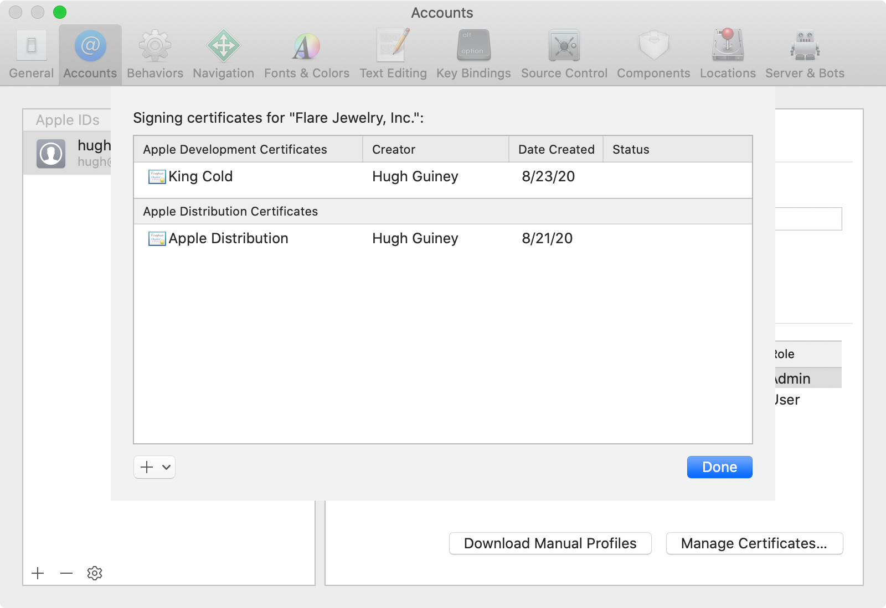
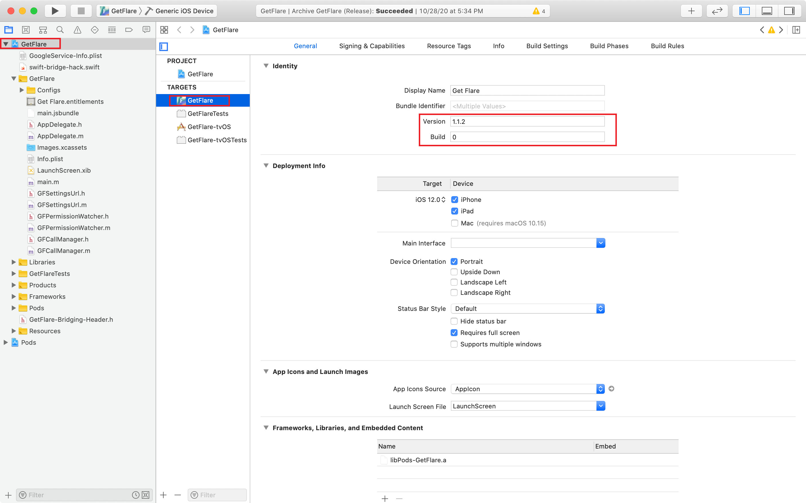
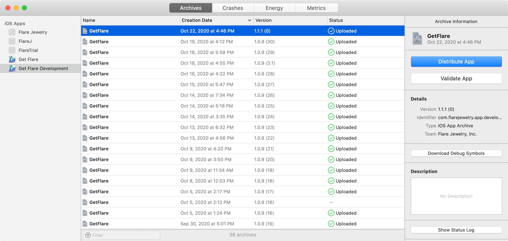
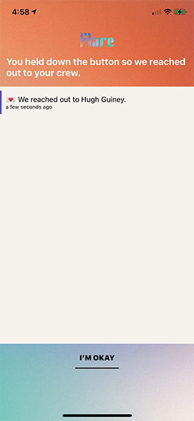
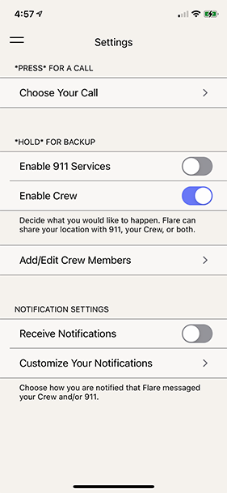
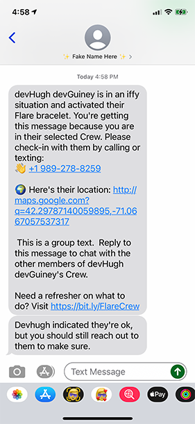

# Flare iOS App

## Installation

```zsh
git clone [repo url]
cd flare

# Install JavaScript dependencies
yarn install

# Install iOS dependencies
cd ios/
pod install
```

## Development

```zsh
# Start Metro Bundler:
yarn start # react-native start

# In a separate tab, start the iOS Simulator
yarn ios # react-native run-ios

# To run iOS Simulator with an older iPhone model:
yarn ios-legacy # react-native run-ios --simulator="iPhone SE (2nd generation)"
```

### API

There are two API endpoints for interfacing with the backend server:

-   **Development**: https://app2.flarejewelry.co/
-   **Production**: https://app.flarejewelry.co/

These are mapped to the `CONFIG_API_URL` Xcode variable depending on the current Build Configuration. **Debug** and **Staging** map to the Development API and **Release** maps to the Production API.

### Flare Account

When you register a new account for development/testing purposes, you can prefix your first and last name with the string `dev` to mark it as a development account. E.g. instead of “Hugh Guiney” you would write “devHugh devGuiney”. Then, when you wish to start over, you can ping the following API endpoint to delete all `dev`-prefixed users from the database.

```http
GET https://app2.flarejewelry.co/api/users/dev/remove_users
```

### App Structure

-   `__tests__/`
-   `android/` - Android project files; not currently in use.
-   `docs/`
-   `ios/` - iOS project files.
-   `node_modules/` - JavaScript dependencies.
-   `patches/` - Hotfixes for dependencies.
-   `src/` - React Native application source.
    -   `actions/`
    -   `assets/` - Images, videos, etc.
    -   `bits/` - Miscellaneous code snippets.
    -   `constants/`
        -   `Config.js` - Environment variables.
        -   `CrewActionConstants.js` - A mapping from Timeline action names to their numerical codes as used in the Timeline API.
        -   `EventTimelineSettings.js` - A mapping from Timeline constants to string IDs specifying the different modes of the Timeline.
        -   `EventTypes.js`
        -   `ManufacturingStages.js`
        -   `Roles.js`
    -   `fonts/`
    -   `helpers/`
    -   `locales/` - Localization strings for all copy in the app. Currently only English (`en.js`) is supported.
    -   `reducers/` - Redux reducers.
    -   `screens/` - The different sections of the app.
        -   `How911Works` - The 911 Walkthrough.
    -   `store/` - Redux store.
    -   `App.js` - App bootstrap.
    -   `App.test.js`
-   `.env` - Environment variables. **⚠️ Warning**: Some (all?) of these variables are not actually used during the build process, so changes here may not affect anything. For the live variables, refer to `src/constants/Config.js`. This file is kept intact just in case it is used somehow.
-   `index.js` - App entrypoint.

## Developer Permissions

Before you can build the app you must be invited to Flare’s [Apple Developer account](https://developer.apple.com/account/#/overview/M8SR977JX7) and assigned the `Developer` role or higher.

Additionally, you have to have active `Development` and `Distribution` certificates from [Certificates, Identifiers & Profiles](https://developer.apple.com/account/resources/certificates/list) installed in your Keychain. If either certificate is expired you will have to click the “+” button and create a new one. You can check which certificates you have instealled or add new ones within Xcode by going to `Xcode → Preferences → Accounts → [Your Apple ID] → Flare Jewelry, Inc.; Manage Certificates`.



Otherwise if each certificate is still valid, you can click the link on its name to download the corresponding `.cer` file. Then, double-click the `.cer` launch Keychain Access and install it. Note that even if you have created a new certificate and installed it to your Keychain, it may take a while for Apple’s servers to recognize it as valid. You won’t be able to upload any app builds to TestFlight or the App Store until that happens.

## Build Process

Building is only possible on a Mac running macOS Catalina or later (10.15+) with Xcode 11 installed. Xcode 12+ will not work unless the React Native version is also upgraded in concert, which requires additional migration work.

Open `ios/GetFlare.xcworkspace` in Xcode.

From the left-hand menu, select `GetFlare → Targets → GetFlare`.



For a TestFlight build, increment the **Build** number.

For an App Store build, increment the **Version** number and reset the Build number to 0.

In the menu bar, go to `Product → Scheme` and select the relevant scheme:

-   `GetFlare Development (Staging)`
-   `GetFlare (Release)`
-   `GetFlare (Debug)`
-   `GetFlare`
    -   This scheme is redundant, but React Native requires a scheme that matches the project name in order for `run-ios` to work.

In the menu bar, go to `Product → Archive`. This will build an executable `.app` file that can be uploaded to App Store Connect.

When the build is complete, in the menu bar, go to `Window → Organizer` and click the **Distribute App** button. Then select `App Store Connect; Next → Upload; Next` and wait for the upload to complete. The upload will only complete successfully if you:

1. Are logged into Xcode with your Apple ID, and
2. Have the appropriate permissions in App Store Connect.



## App Behavior

A flare (also known as an “alarm”) is triggered when the user presses the button on her Bluetooth-connected jewelry. The data flow is as follows:

1. User presses button on jewelery
2. Jewelry sends BLE beacon to the app (one of 20 UUIDs) - `
3. The app examines the beacon payload and decodes a device ID
4. The app submits an API request to the backend including the device ID
5. The backend performs an action depending on the request, connecting to third-party APIs as-needed.

### Short Press

Pressing the button and immediately releasing triggers a real phone call with prerecorded audio on the other end. The call script is configurable in `Menu → Settings → Choose Your Call`. ([`src/screens/Settings/Call.js`](src/screens/Settings/Call.js))


### Long Press

Pressing and holding the button for 3 seconds or more triggers the **Timeline** view ([`src/screens/HomeActive.js`](src/screens/HomeActive.js)). The Timeline shows status updates from the backend as well as texts from the user’s Crew if applicable.



The long-press action is different depending on the user’s settings.



#### Timeline API

##### Example Request

Replace `{{ userId }}` with a real user ID.

```http
GET https://app2.flarejewelry.co/api/user/{{ userId }}crews/event
```

##### Example Response

```json
{
    "actions": [
        {
            "action_type": 4,
            "id": 2802,
            "message": null,
            "name": null,
            "timestamp": "Wed, 19 Aug 2020 15:25:22 GMT"
        },
        {
            "action_type": 1,
            "id": 2803,
            "message": null,
            "name": "Austin",
            "timestamp": "Wed, 19 Aug 2020 15:25:22 GMT"
        },
        {
            "action_type": 1,
            "id": 2804,
            "message": null,
            "name": "Oliver Guiney",
            "timestamp": "Wed, 19 Aug 2020 15:25:22 GMT"
        },
        {
            "action_type": 3,
            "id": 2805,
            "message": null,
            "name": null,
            "timestamp": "Wed, 19 Aug 2020 15:25:41 GMT"
        }
    ],
    "status": "success"
}
```

#### Crew-enabled Flares

When a long-press flare is activated and Crew is enabled, the backend will make an API call to [Twilio](https://www.twilio.com/) to send SMS alerts to the user’s registered contacts.



#### 911 Services–enabled Flares

When a long-press flare is activated and 911 Services are enabled, the backend will make an API call to [Noonlight](https://www.noonlight.com/) that includes the user’s current location and profile information. A Noonlight operative will then text and call the user to assess needs before making a call to emergency responders on her behalf.

## Distribution

The app is not for sale in mainland China due to the Chinese government’s restrictions on the use of [CallKit](https://developer.apple.com/documentation/callkit). It is unknown which part(s) of the app use CallKit since React Native does not make it obvious.
