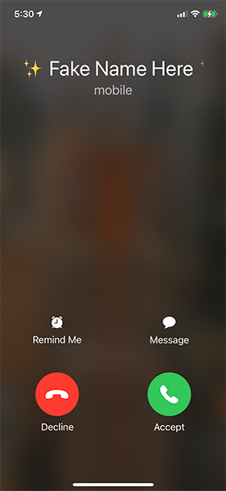

# Flare iOS App

## Installation

```zsh
git clone [repo url]
cd flare

# Install JavaScript dependencies
yarn install

# Install iOS dependencies
cd ios/
pod install
```

## Development

```zsh
# Start Metro Bundler:
yarn start # react-native start

# In a separate tab, start the iOS Simulator
yarn ios # react-native run-ios

# To run iOS Simulator with an older iPhone model:
yarn ios-legacy # react-native run-ios --simulator="iPhone SE (2nd generation)"
```

### Flare Account

When you register a new account for development/testing purposes, you can prefix your first and last name with the string `dev` to mark it as a development account. E.g. instead of “Hugh Guiney” you would write “devHugh devGuiney”. Then, when you wish to start over, you can ping the following API endpoint to delete all `dev`-prefixed users from the database.

```http
GET https://app2.flarejewelry.co/api/users/dev/remove_users
```

### App Structure

- `__tests__/`
- `android/` - Android project files; not currently in use.
- `docs/`
- `ios/` - iOS project files.
- `node_modules/` - JavaScript dependencies.
- `patches/` - Hotfixes for dependencies.
- `src/` - React Native application source.
  - `actions/`
  - `assets/` - Images, videos, etc.
  - `bits/` - Miscellaneous code snippets.
  - `constants/`
    - `Config.js` - Environment variables.
    - `CrewActionConstants.js` - A mapping from Timeline action names to their numerical codes as used in the Timeline API.
    - `EventTimelineSettings.js` - A mapping from Timeline constants to string IDs specifying the different modes of the Timeline.
    - `EventTypes.js`
    - `ManufacturingStages.js`
    - `Roles.js`
  - `fonts/`
  - `helpers/`
  - `locales/` - Localization strings for all copy in the app. Currently only English (`en.js`) is supported.
  - `reducers/` - Redux reducers.
  - `screens/` - The different sections of the app.
    - `How911Works` - The 911 Walkthrough.
  - `store/` - Redux store.
  - `App.js` - App bootstrap.
  - `App.test.js`
- `.env` - Environment variables. **⚠️ Warning**: Some (all?) of these variables are not actually used during the build process, so changes here may not affect anything. For the live variables, refer to `src/constants/Config.js`. This file is kept intact just in case it is used somehow.
- `index.js` - App entrypoint.

## Developer Permissions

Before you can build the app you must be invited to Flare’s [Apple Developer account](https://developer.apple.com/account/#/overview/M8SR977JX7) and assigned the `Developer` role or higher.

Additionally, you have to have active `Development` and `Distribution` certificates from [Certificates, Identifiers & Profiles](https://developer.apple.com/account/resources/certificates/list) installed in your Keychain. If either certificate is expired you will have to click the “+” button and create a new one. You can check which certificates you have instealled or add new ones within Xcode by going to `Xcode → Preferences → Accounts → [Your Apple ID] → Flare Jewelry, Inc.; Manage Certificates`.


Otherwise if each certificate is still valid, you can click the link on its name to download the corresponding `.cer` file. Then, double-click the `.cer` launch Keychain Access and install it. Note that even if you have created a new certificate and installed it to your Keychain, it may take a while for Apple’s servers to recognize it as valid. You won’t be able to upload any app builds to TestFlight or the App Store until that happens.

## Build Process

Building is only possible on a Mac running macOS Catalina or later (10.15+) with Xcode 11 installed. Xcode 12+ will not work unless the React Native version is also upgraded in concert, which requires additional migration work.

Open `ios/GetFlare.xcworkspace` in Xcode.

From the left-hand menu, select `GetFlare → Targets → GetFlare`.


For a TestFlight build, increment the **Build** number.

For an App Store build, increment the **Version** number and reset the Build number to 0.

In the menu bar, go to `Product → Scheme` and select the relevant scheme:

- `GetFlare Development (Staging)`
- `GetFlare (Release)`
- `GetFlare (Debug)`
- `GetFlare`
  - This scheme is redundant, but React Native requires a scheme that matches the project name in order for `run-ios` to work.

In the menu bar, go to `Product → Archive`. This will build an executable `.app` file that can be uploaded to App Store Connect.

When the build is complete, in the menu bar, go to `Window → Organizer` and click the **Distribute App** button. Then select `App Store Connect; Next → Upload; Next` and wait for the upload to complete. The upload will only complete successfully if you:

1. Are logged into Xcode with your Apple ID, and
2. Have the appropriate permissions in App Store Connect.


## App Behavior

A flare (also known as an “alarm”) is triggered when the user presses the button on her Bluetooth-connected jewelry. The data flow is as follows:

1. User presses button on jewelery
2. Jewelry sends BLE beacon to the app (one of 20 UUIDs) - `
3. The app examines the beacon payload and decodes a device ID
4. The app submits an API request to the backend including the device ID
5. The backend performs an action depending on the request, connecting to third-party APIs as-needed.

### Short Press

Pressing the button and immediately releasing triggers a real phone call with prerecorded audio on the other end. The call script is configurable in `Menu → Settings → Choose Your Call`. ([`src/screens/Settings/Call.js`](src/screens/Settings/Call.js))



### Long Press

Pressing and holding the button for 3 seconds or more triggers the **Timeline** view ([`src/screens/HomeActive.js`](src/screens/HomeActive.js)). The Timeline shows status updates from the backend as well as texts from the user’s Crew if applicable.


The long-press action is different depending on the user’s settings.


#### Crew-enabled Flares

When a long-press flare is activated and Crew is enabled, the backend will make an API call to [Twilio](https://www.twilio.com/) to send SMS alerts to the user’s registered contacts.


#### 911 Services–enabled Flares

When a long-press flare is activated and 911 Services are enabled, the backend will make an API call to [Noonlight](https://www.noonlight.com/) that includes the user’s current location and profile information. A Noonlight operative will then text and call the user to assess needs before making a call to emergency responders on her behalf.

## Distribution

The app is not for sale in mainland China due to the Chinese government’s restrictions on the use of [CallKit](https://developer.apple.com/documentation/callkit). It is unknown which part(s) of the app use CallKit since React Native does not make it obvious.

## APIs

<!--

Endpoints are listed alphabetically.

Template:

### API Name

- **Endpoint**: `/api/endpoint`
- **Method**: `GET`/`POST`/etc.
- **Authenticated**: Yes/No
- **Idempotent**: Yes/No
- **Callers**:
  - `` in [``]()
- **Views**:
  - [``]()
- **Localizations**: `Strings.` in [`src/locales/*.js`](src/locales/en.js)
- **Constants**: [`src/constants/`]()

#### Example: 200 OK

```http
GET https://app2.flarejewelry.co/api/endpoint
```

```json
{}
```

#### Example: 400 Bad Request/etc.
-->

There are two base URLs for interfacing with the backend server:

- **Development**: https://app2.flarejewelry.co/
- **Production**: https://app.flarejewelry.co/

These are mapped to the `CONFIG_API_URL` Xcode variable depending on the current Build Configuration. The **Debug** and **Staging** configurations map to the Development API. The **Release** configuration maps to the Production API.

All examples herein point to the Development API.

### App Status

- **Endpoint**: `/api/auth/status`
- **Method**: `POST`
- **Authenticated**: Yes
- **Idempotent**: Yes
- **Callers**:
  - `syncAccountDetails()` in [`src/actions/userActions.js`](src/actions/userActions.js)
  - `syncAccount()` in [`src/screens/HomeActive.js`](src/screens/HomeActive.js)
  - `componentDidMount()` in [`src/screens/Home/index.js`](src/screens/Home/index.js)
  - `syncAccount()` in [`src/screens/Home/index.js`](src/screens/Home/index.js)
- **Views**:
  - [`src/screens/Home/index.js`](src/screens/Home/index.js)
  - [`src/screens/HomeActive.js`](src/screens/HomeActive.js)
- **Constants**:
  - `ACCOUNT_DETAILS_*` in [`src/actions/actionTypes.js`](src/actions/actionTypes.js)
  - `ACCOUNT_SYNC_INTERVAL*` in [`src/constants/Config.js`](src/constants/Config.js)

The App Status endpoint is used to send information about the current user to the server for logging purposes.

When the user is logged in, app statuses send at the interval defined by `ACCOUNT_SYNC_INTERVAL`. They do not include location data [???].

When a long-press flare is active, app statuses send at the interval defined by `ACCOUNT_SYNC_INTERVAL_FLARE`. They do inc

The reason for having two separate timings is so that app statuses can be sent more frequently in the case of an emergency.

#### Example: 200 OK

```http
POST https://app2.flarejewelry.co/api/auth/status
```

```json
{
  "timestamp": "2020-10-31 20:52:45",
  "latitude": "40.66772",
  "longitude": "-73.875537",
  "details": {
    "permissions": {},
    "hardware": {},
    "position": {}
  }
}
```

```json
{
  "analytics_enabled": true,
  "call_script": 4,
  "crew_events": [],
  "crews": [
    {
      "is_default": true,
      "members": [
        {
          "id": 1171,
          "label": " - mobile",
          "name": "Hugh Guiney",
          "phone": "+16175551234"
        }
      ],
      "name": "New Crew"
    }
  ],
  "devices": [
    {
      "id": 5443,
      "type": 2
    }
  ],
  "profile": {
    "active": true,
    "created_at": "Wed, 14 Oct 2020 18:29:19 GMT",
    "email": "hugh@duomo.dev",
    "first_name": "devHugh",
    "id": 658,
    "last_name": "devGuiney"
  },
  "referral_key": "fl-edggdx",
  "role": 0,
  "status": "success",
  "viewed_tutorial": true
}
```

### Delete Dev Users

- **Endpoint**: `/api/users/dev/remove_users`
- **Method**: `GET`
- **Authenticated**: No
- **Idempotent**: No
- **Callers**: Manual

#### Example: 200 OK

```http
GET https://app2.flarejewelry.co/api/users/dev/remove_users
```

```json
{
  "message": "Dev users removed",
  "status": "success"
}
```

### Settings: Toggle 911 Services

- **Endpoint**: `/api/config/user/__userId__/toggle_ems`
- **Method**: `POST`
- **Authenticated**: Yes
- **Idempotent**: No
- **Callers**:
  - `set911Features()` in [`src/actions/userActions.js`](src/actions/userActions.js)
  - `setEnable911Feature()` in [`src/screens/Settings/Home.js`](src/screens/Settings/Home.js)
  - `enable911()` in [`src/screens/How911Works/GotYourBack.js`](src/screens/How911Works/GotYourBack.js)
- **Views**:
  - [`src/screens/Settings/Home.js`](src/screens/Settings/Home.js)

Calling this endpoint flips the user’s 911 Services setting in the database, then returns the new value.

If `ems_services` comes back `true`, the setting is now enabled, and the next long-press will trigger outreach to Noonlight.

If `ems_services` comes back `false`, the setting is now disabled, and the next long-press will not trigger outreach to Noonlight.

#### Example: 200 OK

Assuming the user’s 911 Services setting was initially enabled:

```http
POST https://app2.flarejewelry.co/api/config/user/591/toggle_ems
```

```json
{
  "ems_services": false,
  "user_id": "591"
}
```

```http
POST https://app2.flarejewelry.co/api/config/user/591/toggle_ems
```

```json
{
  "ems_services": true,
  "user_id": "591"
}
```

### Settings: Toggle Crew

- **Endpoint**: `/api/config/user/__userId__/toggle_crew`
- **Method**: `POST`
- **Authenticated**: Yes
- **Idempotent**: No
- **Callers**:
  - `setCrewEnabled()` in [`src/actions/userActions.js`](src/actions/userActions.js)
  - `performSave()` in [`src/screens/Contacts/index.js`](src/screens/Contacts/index.js)
- **Views**:
  - [`src/screens/Contacts/index.js`](src/screens/Contacts/index.js)
  - [`src/screens/Settings/Home.js`](src/screens/Settings/Home.js)

Calling this endpoint flips the user’s Crew setting in the database, then returns the new value.

If `crew_services` comes back `true`, the setting is now enabled, and the next long-press will trigger outreach to Crew Members.

If `crew_services` comes back `false`, the setting is now disabled, and the next long-press will not trigger outreach to Crew Members.

#### Example: 200 OK

Assuming the user’s Crew setting was initially disabled:

```http
POST https://app2.flarejewelry.co/api/config/user/591/toggle_crew
```

```json
{
  "crew_services": true,
  "user_id": "591"
}
```

```http
POST https://app2.flarejewelry.co/api/config/user/591/toggle_crew
```

```json
{
  "crew_services": false,
  "user_id": "591"
}
```

### Timeline

- **Endpoint**: `/api/user/__userID__/crews/event`
- **Method**: `GET`
- **Authenticated**: Yes
- **Idempotent**: Yes
- **Callers**:
  - `getEventTimeline()` in [`src/actions/userActions.js`](src/actions/userActions.js)
- **Views**:
  - [`src/screens/HomeActive.js`](src/screens/HomeActive.js)
  - [`src/bits/EventTimeline.js`](src/bits/EventTimeline.js)
- **Localizations**: `Strings.eventTimeline.headings` in [`src/locales/*.js`](src/locales/en.js)
- **Constants**: [`src/constants/CrewActionConstants.js`](src/constants/CrewActionConstants.js)

The Timeline endpoint is called when the user activates a long-press. Once activated, the frontend will periodically poll the server for updates to the `actions` array. Each action in the array has an associated `action_type`, a numerical ID that maps to a different message in the UI.

| Action Type | Action Type Name | Example Message Text                                       |
| ----------- | ---------------- | ---------------------------------------------------------- |
| 0           | Unknown          | 🤮 Something got mixed up on our end                       |
| 1           | Notification     | 💌 We reached out to [Crew Member]                         |
| 2           | Response         | [SMS from Crew Member]                                     |
| 3           | Cancel           | 🚫 You canceled the message.                               |
| 4           | Create           | 📣 You started a message.                                  |
| 5           | Join             | [Crew Member] is available.                                |
| 6           | Expire           | Your message expired.                                      |
| 7           | NoonlightCreated | 🚨 You activated the 911 feature.                          |
| 8           | SentToNoonlight  | 📍 Flare shared your location with 911 dispatchers.        |
| 9           | NoonlightSuccess | Noonlight will contact you; be sure to respond if you can. |

#### Example: 200 OK

```http
GET https://app2.flarejewelry.co/api/user/591/crews/event
```

```json
{
  "actions": [
    {
      "action_type": 4,
      "id": 2802,
      "message": null,
      "name": null,
      "timestamp": "Wed, 19 Aug 2020 15:25:22 GMT"
    },
    {
      "action_type": 1,
      "id": 2803,
      "message": null,
      "name": "Austin",
      "timestamp": "Wed, 19 Aug 2020 15:25:22 GMT"
    },
    {
      "action_type": 1,
      "id": 2804,
      "message": null,
      "name": "Oliver Guiney",
      "timestamp": "Wed, 19 Aug 2020 15:25:22 GMT"
    },
    {
      "action_type": 3,
      "id": 2805,
      "message": null,
      "name": null,
      "timestamp": "Wed, 19 Aug 2020 15:25:41 GMT"
    }
  ],
  "status": "success"
}
```

Given this response, the UI would display the following messages in the Timeline:

1. 📣 You started a message.
2. 💌 We reached out to Austin.
3. 💌 We reached out to Oliver Guiney.
4. 🚫 You canceled the message.
